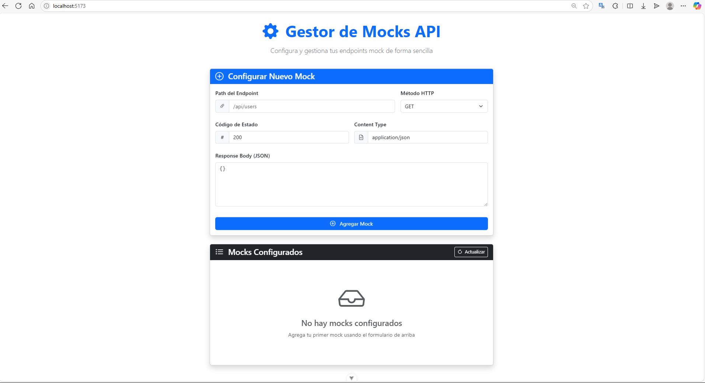

# API de Mocks para Servicios REST

## Objetivos

### Objetivo General

- Implementar y diseñar una API REST robusta en Go con Fiber que permita al usuario gestionar y simular dinámicamente respuestas personalizadas para endpoints de servicios externos, facilitando las pruebas en el desarrollo.

### Objetivos Específicos

- **Definir Estructura de Mocks:** Establecer una estructura clara y flexible para almacenar las configuraciones de los mocks, incluyendo ruta, método HTTP, parámetros de URL, `headers`, cuerpo de la solicitud, código de estado, tipo de contenido y contenido de la respuesta.

- **Implementar un Módulo de Configuración de Mocks:** Desarrollar los endpoints para la gestión completa de las configuraciones de mocks.

- **Desarrollar un Enrutamiento Dinámico de Mocks:** Crear un mecanismo que intercepte solicitudes entrantes, compare características con las configuraciones de los mocks almacenados y devuelva la respuesta predefinida correspondiente.

- **Asegurar la Calidad del Código y Documentación:** Aplicar buenas prácticas de desarrollo y proporcionar una documentación clara para la instalación y uso de la API.

## Arquitectura y Diseño del Sistema

El proyecto sigue una arquitectura de microservicio desacoplado con dos componentes principales: un backend API y una interfaz de usuario frontend.

### 1. Componentes Principales

-   **Backend (API de Mocks):** Desarrollado en Go utilizando el framework Fiber. Es el responsable de:
    -   Almacenar y gestionar las configuraciones de los mocks.
    -   Interceptar todas las solicitudes entrantes en rutas genéricas (excepto las de gestión).
    -   Evaluar las solicitudes contra las configuraciones de mocks para encontrar la coincidencia más apropiada.
    -   Devolver las respuestas simuladas según la configuración encontrada.

-   **Frontend (Interfaz de Usuario):** Desarrollado en Vue.js 3 con Vite. Proporciona una interfaz gráfica intuitiva para que los usuarios puedan:
    -   Crear nuevas configuraciones de mocks mediante un formulario interactivo.
    -   Visualizar una lista de todas las configuraciones de mocks activas.
    -   Eliminar configuraciones existentes.
    -   Recibir retroalimentación visual sobre el estado de las operaciones.

### 2. Funcionalidades Clave Implementadas

#### 2.1. Gestión de Configuración de Mocks

-   **Creación de Mocks** `POST /configure-mock`
    -   Permite registrar una nueva configuración de mock.
    -   Soporta la definición de `path`, `method`, `queryParams`, `headers` y `requestBody`.
    -   Permite la especificación del `statusCode`, `contentType` y `body` de la respuesta simulada.

-   **Listado de Mocks** `GET /configure-mock`
    -   Devuelve una lista de todas las configuraciones de mocks activas.

-   **Eliminación de Mocks** `DELETE /configure-mock/:id`
    -   Permite eliminar una configuración de mock específica utilizando su ID único.

#### 2.2. Ejecución de Mocks (Enrutamiento Dinámico)

-   **Enrutamiento Genérico**
    -   La API está configurada para interceptar cualquier solicitud HTTP entrante que no corresponda a sus rutas de administración.

-   **Coincidencia de Mocks**
    -   A partir de cada solicitud entrante, el sistema buscará la configuración de mock más apropiada basándose en:
        -   **La ruta exacta:** La ruta de la solicitud debe coincidir con la `path` configurada.
        -   **Método HTTP:** El método de la solicitud debe coincidir con el `method` configurado.
        -   **Parámetros de URL:** Si el mock tiene `queryParams` definidos, la solicitud debe contener esos parámetros con sus valores exactos.
        -   **Encabezados:** Si el mock tiene `headers` definidos, la solicitud debe incluir esos encabezados con sus valores exactos.
        -   **Cuerpo de la solicitud:** Si el mock tiene `bodyParams` definidos, el cuerpo JSON de la solicitud debe contener esos pares clave-valor exactos en el nivel superior.

-   **Devolución de Respuesta**
    -   Si se encuentra un mock que coincida, la API responderá con el `statusCode`, `contentType` y `body` definidos en la configuración del mock.
    -   Si no se encuentra ninguna coincidencia, la API devolverá un `404 Not Found`.

### 3. Decisiones de Diseño

#### 3.1. Selección de Tecnologías

-   **Go (Backend):** Elegido por su alto rendimiento, su modelo de concurrencia eficiente y su capacidad de compilación que facilitan el despliegue.

-   **Fiber (Framework Go):** Proporciona una API similar a Express.js, lo que agiliza el desarrollo rápido y eficiente de rutas HTTP y middlewares.

-   **Vue.js 3 (Frontend):** Seleccionado por su facilidad intuitiva de desarrollo, su  eficiencia y su capacidad para construir interfaces de usuario de forma declarativa.

-   **Vite:** Proporciona tiempos de carga rápidos en desarrollo (HMR) y es la herramienta de construcción recomendada actualmente para proyectos Vue.js, mejorando la experiencia del desarrollador.

-   **Bootstrap 5 & Icons:** Utilizado para un diseño responsive y atractivo con componentes predefinidos y una iconografía clara, acelerando el desarrollo de la UI.

#### 3.2. Almacenamiento de Mocks

La configuración de los mocks se almacena dentro de la carpeta `config` en formato JSON. Esta decisión se tomó para la simplicidad, velocidad de acceso y, crucialmente, para preservar la configuración al apagar o reiniciar el servidor, ofreciendo persistencia de datos.

#### 3.3. Generación de IDs

Se utiliza la librería `github.com/google/uuid` para asegurar la IDs únicos para cada mock, especialmente cuando no se proporciona un ID explícitamente en la configuración.

#### 3.4. Manejo de Errores

Se implementa un manejo de errores robusto tanto en el backend (respuestas JSON con códigos de estado HTTP apropiados y mensajes descriptivos) como en el frontend (alertas visuales al usuario), para proporcionar una experiencia de uso clara y consistente.

## 🛠️ Requisitos del Sistema

### Hardware

-   **Memoria RAM:** 512 MB (Recomendado 1 GB+ para desarrollo).

-   **Espacio en Disco:** 200 MB libre (para el código fuente, entorno Go, y dependencias).

-   **Procesador:** Cualquier CPU medianamente moderna.

### Software

-   **Sistema Operativo:** Compatible con Go (Linux, macOS, Windows).

-   **Go:** Versión 1.21 o superior.

-   **Git:** Para clonar el repositorio.

-   **Herramientas de Cliente HTTP:** cURL, Postman, Insomnia o similar para interactuar con la API.

-   **IDE/Editor:** Visual Studio Code (recomendado) con extensiones para Go, u otro editor/IDE de preferencia.

-   **Terminal/Consola:** Para compilar y ejecutar el backend.

-   **Node.js:** Versión 16 o superior (para el frontend con Vue/Vite).

-   **npm o Yarn:** Para gestionar las dependencias del frontend.

## 🚀 Instalación y Ejecución

### Backend

1.  **Clonar el Repositorio:**
    ```bash
    git clone [https://github.com/Ennero/challengestart_EnnerMendizabal.git](https://github.com/Ennero/challengestart_EnnerMendizabal.git)

    cd challengestart_EnnerMendizabal/backend 
    ```

2.  **Descargar dependencias:**
    ```bash
    go mod tidy
    ```

3.  **Ejecutar la aplicación:**
    ```bash
    go run main.go
    ```
    La API se ejecutará en `http://localhost:3000` de forma predeterminada.
    Para iniciar con un puerto diferente:
    ```bash
    # Para Linux o macOS
    PORT=8080 go run main.go

    # Para CMD de Windows
    set PORT=8080 && go run main.go

    # Para PowerShell de Windows
    $env:PORT="8080"; go run main.go
    ```

### Frontend

Adicionalmente, para facilitar el uso del programa, se incluye una interfaz de usuario web que permite la configuración simple de nuevos mocks:

1.  **Dirigirse a la ubicación del archivo**
    ```bash
    cd challengestart_EnnerMendizabal/frontend
    ```

2.  **Descargar las dependencias**
    ```bash
    npm install

    # Opcional: para formatear el código
    npm run format 
    ```

3.  **Ejecutar la aplicación**
    ```bash
    npm run dev
    ```

4.  **Acceder a la aplicación:** Abre tu navegador y navega a la URL que te indicará Vite (usualmente `http://localhost:5173`).
   
    

## Ejemplo de Uso

*(Aquí puedes insertar los ejemplos de `curl` y/o capturas de pantalla de Postman/Insomnia que demuestren cómo usar la API)*

## Uso de herramientas IA

Esta sección detallará los prompts utilizados para acelerar el desarrollo de este proyecto dividido por LLM:

### Gemini

1.  ¿Qué son los mocks?

2.  Mi proyecto es crear un mock pero no sé qué es como se podría hacer, ¿podrías darme una idea de cómo hacerlo o un ejemplo?

3.  ¿Lo haré con go y fiber, cómo debería de empezar?

4.  ¿Cómo podría agregarle una variable de entorno para no quemar el puerto?

5.  Ya que te pasé todo, ¿cómo podría probarlo y saber si funciona correctamente?

6.  Entonces lo crearé el frontend en Vue con Vite, ¿cómo lo hago?

7.  Así dejé lo de Vue: ``#código .vue``. Adicionalmente me pregunto por qué tuve que hacer los cambio en el backend de Go, dado a que entendería que funciona con cualquier host que le envíe una solicitud ¿no? Puesto a que me funcionó correctamente usando Postman.

8. Así está lo que tengo del readme, ¿sigue correctamente la estructura que solicita el enunciado que debe de tener?

9. Agrega las corrección que me mencionaste y retorname el código .md ya corregido, modificando unicamente lo que me indicaste, menos la parte en donde dictamina que se guarda en memoria, porque lo modifiqué para que se preserven los datos

  


### Claude

1.  Haz que el siguiente código de VueJS sea más estético y que, de ser posible, que use lo máximo que se pueda Bootstrap con el CDN.

2.  Haz que se use lo menos posible el CSS para usar Bootstrap en su lugar, además reduce el ancho de la card que contiene todo.

3.  De esta estructura de archivo con VueJS con Vite, ¿qué debería de eliminar sin que afecte el funcionamiento del programa o que puedo agregar al `.gitignore`?