# API de Mocks para Servicios REST

## 📄 Tabla de Contenidos

- [API de Mocks para Servicios REST](#api-de-mocks-para-servicios-rest)
  - [📄 Tabla de Contenidos](#-tabla-de-contenidos)
  - [🎯 Objetivos](#-objetivos)
    - [Objetivo General](#objetivo-general)
    - [Objetivos Específicos](#objetivos-específicos)
  - [🏛️ Arquitectura y Diseño del Sistema](#️-arquitectura-y-diseño-del-sistema)
    - [1. Componentes Principales](#1-componentes-principales)
    - [2. Funcionalidades Clave Implementadas](#2-funcionalidades-clave-implementadas)
      - [2.1. Gestión de Configuración de Mocks](#21-gestión-de-configuración-de-mocks)
      - [2.2. Ejecución de Mocks (Enrutamiento Dinámico)](#22-ejecución-de-mocks-enrutamiento-dinámico)
    - [3. Decisiones de Diseño](#3-decisiones-de-diseño)
      - [3.1. Selección de Tecnologías](#31-selección-de-tecnologías)
      - [3.2. Persistencia de Mocks](#32-persistencia-de-mocks)
      - [3.3. Generación de IDs Únicos](#33-generación-de-ids-únicos)
      - [3.4. Manejo de Errores](#34-manejo-de-errores)
  - [🛠️ Requisitos del Sistema](#️-requisitos-del-sistema)
    - [Hardware](#hardware)
    - [Software](#software)
  - [🚀 Instalación y Ejecución](#-instalación-y-ejecución)
    - [Backend](#backend)
    - [Frontend](#frontend)
  - [💡 Ejemplo de Uso](#-ejemplo-de-uso)
    - [Uso sin Frontend (mediante cURL)](#uso-sin-frontend-mediante-curl)
    - [Uso con Frontend (Interfaz de Usuario Web)](#uso-con-frontend-interfaz-de-usuario-web)
  - [🤖 Uso de Herramientas de IA](#-uso-de-herramientas-de-ia)
    - [Gemini 2.5 Flash](#gemini-25-flash)
    - [Claude Sonnet 4](#claude-sonnet-4)

---

## 🎯 Objetivos

### Objetivo General

- Implementar y diseñar una API REST robusta en Go con el framework Fiber que permita a los usuarios gestionar y simular dinámicamente respuestas personalizadas para endpoints de servicios externos, con el fin de facilitar las pruebas y el desarrollo.

### Objetivos Específicos

- **Definir una Estructura de Mocks Flexible:** Establecer un formato claro para almacenar las configuraciones de los mocks, incluyendo `path`, `method`, `queryParams`, `headers`, `bodyParams`, `responseStatusCode`, `contentType`, `responseBody`, y el indicador `isTemplate`.
- **Implementar un Módulo de Gestión de Mocks:** Desarrollar endpoints dedicados para la creación, listado y eliminación de las configuraciones de mocks.
- **Desarrollar un Enrutamiento Dinámico Inteligente:** Crear un mecanismo capaz de interceptar solicitudes entrantes, compararlas con las configuraciones de mocks almacenadas (priorizando coincidencias), y devolver la respuesta predefinida o procesada de la plantilla.
- **Asegurar la Calidad del Código y Documentación:** Aplicar buenas prácticas de desarrollo (manejo de errores, código limpio) y proporcionar una documentación exhaustiva para la instalación, uso y comprensión de la API.

## 🏛️ Arquitectura y Diseño del Sistema

El proyecto sigue una arquitectura de microservicio desacoplado, compuesta por dos componentes principales que interactúan entre sí: un **backend API** y una **interfaz de usuario frontend**.

### 1. Componentes Principales

-   **Backend (API de Mocks):** Desarrollado en **Go** utilizando el framework **Fiber**. Sus responsabilidades clave son:
    -   Almacenar y gestionar las configuraciones de los mocks de manera persistente en un archivo JSON.
    -   Interceptar todas las solicitudes HTTP entrantes que no sean rutas de administración.
    -   Evaluar las solicitudes contra un conjunto ordenado de configuraciones de mocks para encontrar la coincidencia más apropiada.
    -   Generar y devolver las respuestas simuladas, incluyendo el procesamiento de plantillas dinámicas si el mock lo requiere.

-   **Frontend (Interfaz de Usuario):** Desarrollado en **Vue.js 3** con **Vite**. Proporciona una interfaz gráfica intuitiva que permite a los usuarios:
    -   Crear y configurar nuevos mocks fácilmente a través de un formulario interactivo.
    -   Visualizar una lista de todas las configuraciones de mocks activas con sus detalles.
    -   Eliminar configuraciones de mocks existentes con confirmación.
    -   Recibir retroalimentación visual inmediata sobre el estado de las operaciones.

### 2. Funcionalidades Clave Implementadas

#### 2.1. Gestión de Configuración de Mocks

La API ofrece los siguientes endpoints para la administración de mocks:

-   **Creación/Actualización de Mocks** `POST /configure-mock`
    -   Permite registrar una nueva configuración de mock o actualizar una existente (si se proporciona un `id`).
    -   Soporta la definición de `path`, `method`, `queryParams`, `headers`, y `bodyParams` para establecer los criterios de coincidencia.
    -   Permite especificar el `responseStatusCode`, `contentType` y `responseBody` de la respuesta simulada.
    -   Incluye un flag `isTemplate` para indicar si `responseBody` debe ser procesado como una plantilla Go `text/template`.
    -   Se puede asignar una `priority` (número entero) para resolver conflictos cuando múltiples mocks podrían coincidir con una solicitud.

-   **Listado de Mocks** `GET /configure-mock`
    -   Devuelve una lista completa de todas las configuraciones de mocks actualmente activas en el sistema.

-   **Eliminación de Mocks** `DELETE /configure-mock/:id`
    -   Permite eliminar una configuración de mock específica utilizando su ID único.

#### 2.2. Ejecución de Mocks (Enrutamiento Dinámico)

El corazón de la API radica en su capacidad para interceptar y responder a solicitudes dinámicamente:

-   **Interceptación Genérica:** La API está configurada para interceptar cualquier solicitud HTTP entrante que no coincida con sus rutas de administración (`/configure-mock`).
-   **Proceso de Coincidencia:** Por cada solicitud entrante, el sistema buscará la configuración de mock más apropiada siguiendo un orden de prioridad y verificando los siguientes criterios:
    -   **Ruta (`path`):** La ruta de la solicitud debe coincidir exactamente con la `path` configurada en el mock.
    -   **Método HTTP (`method`):** El método de la solicitud (ej. `GET`, `POST`) debe coincidir (ignorando mayúsculas/minúsculas) con el `method` configurado.
    -   **Parámetros de Consulta (`queryParams`):** Si el mock tiene `queryParams` definidos, la solicitud debe contener *todos* esos parámetros con sus valores exactos.
    -   **Encabezados (`headers`):** Si el mock tiene `headers` definidos, la solicitud debe incluir *todos* esos encabezados (ignorando mayúsculas/minúsculas en el nombre) con sus valores exactos.
    -   **Cuerpo de la Solicitud (`bodyParams`):** Si el mock tiene `bodyParams` definidos (esperando JSON), el cuerpo JSON de la solicitud debe contener *todos* esos pares clave-valor exactos en el nivel superior.
-   **Resolución de Conflictos:** Los mocks se almacenan y evalúan por prioridad (número más alto = mayor prioridad). En caso de múltiples coincidencias, se selecciona el mock con la prioridad más alta.
-   **Generación de Respuesta:**
    -   Si se encuentra un mock que coincida, la API responderá con el `responseStatusCode`, `contentType` y `responseBody` definidos en la configuración del mock.
    -   Si el mock está marcado como `isTemplate: true`, el `responseBody` se procesará como una plantilla Go `text/template`, permitiendo respuestas dinámicas que incluyen datos de la solicitud (path, query params, headers, body).
    -   Si no se encuentra ninguna coincidencia después de evaluar todos los mocks, la API devolverá un `404 Not Found` por defecto.

### 3. Decisiones de Diseño

#### 3.1. Selección de Tecnologías

-   **Go (Backend):** Elegido por su alto rendimiento, su modelo de concurrencia eficiente (goroutines) y su facilidad para compilar a binarios estáticos, lo que simplifica el despliegue.
-   **Fiber (Framework Go):** Proporciona una API de enrutamiento rápida y familiar (similar a Express.js), ideal para el desarrollo ágil de APIs REST y middlewares de alto rendimiento.
-   **Vue.js 3 (Frontend):** Seleccionado por su curva de aprendizaje suave, su rendimiento reactivo y su enfoque declarativo para construir interfaces de usuario, lo que agiliza el desarrollo del frontend.
-   **Vite:** Un bundler de desarrollo rápido para Vue.js (y otros frameworks) que ofrece recarga en caliente (HMR) instantánea y optimizaciones de build, mejorando significativamente la experiencia del desarrollador.
-   **Bootstrap 5 & Bootstrap Icons:** Utilizados para un diseño responsive y atractivo, aprovechando sus componentes predefinidos y una amplia biblioteca de iconos para acelerar el desarrollo de la interfaz de usuario.

#### 3.2. Persistencia de Mocks

Las configuraciones de los mocks se almacenan en un archivo JSON dentro de la carpeta `config`. Esta decisión se tomó para garantizar la persistencia de los datos, lo que significa que las configuraciones no se pierden al apagar o reiniciar el servidor, facilitando un entorno de desarrollo consistente.

#### 3.3. Generación de IDs Únicos

Se utiliza la librería `github.com/google/uuid` para generar identificadores únicos (UUIDs) para cada mock. Esto asegura que cada configuración de mock tenga un ID distintivo, especialmente cuando no se proporciona explícitamente durante la creación.

#### 3.4. Manejo de Errores

Se ha implementado un manejo de errores robusto en toda la aplicación. El backend proporciona respuestas JSON con códigos de estado HTTP apropiados y mensajes descriptivos. El frontend, por su parte, muestra alertas visuales al usuario, garantizando una experiencia clara y consistente incluso cuando ocurren problemas.

## 🛠️ Requisitos del Sistema

### Hardware

-   **Memoria RAM:** 512 MB (se recomienda 1 GB o más para una experiencia de desarrollo fluida).
-   **Espacio en Disco:** Aproximadamente 200 MB libres (para el código fuente, entorno Go y dependencias de Go/Node.js).
-   **Procesador:** Cualquier CPU medianamente moderna.

### Software

-   **Sistema Operativo:** Compatible con Go (Linux, macOS, Windows).
-   **Go:** Versión 1.21 o superior.
-   **Git:** Para clonar el repositorio.
-   **Cliente HTTP:** Herramientas como cURL, Postman, Insomnia o Thunder Client para interactuar con la API.
-   **IDE/Editor de Código:** Visual Studio Code (recomendado) con las extensiones para Go y Vue, o cualquier otro editor/IDE de preferencia.
-   **Terminal/Consola:** Para compilar y ejecutar el backend.
-   **Node.js:** Versión 16 o superior (necesario para el frontend con Vue/Vite).
-   **npm o Yarn:** Para gestionar las dependencias del frontend.

## 🚀 Instalación y Ejecución

### Backend

1.  **Clonar el Repositorio:**
    ```bash
    git clone [https://github.com/Ennero/challengestart_EnnerMendizabal.git](https://github.com/Ennero/challengestart_EnnerMendizabal.git)
    cd challengestart_EnnerMendizabal/backend
    ```
2.  **Descargar dependencias:**
    ```bash
    go mod tidy
    ```
3.  **Ejecutar la aplicación:**
    ```bash
    go run main.go
    ```
    La API se ejecutará en `http://localhost:3000` de forma predeterminada.
    Para iniciar con un puerto diferente (ej. 8080):
    ```bash
    # Para Linux o macOS
    PORT=8080 go run main.go

    # Para CMD de Windows
    set PORT=8080 && go run main.go

    # Para PowerShell de Windows
    $env:PORT="8080"; go run main.go
    ```

### Frontend

Se incluye una interfaz de usuario web para facilitar la configuración de nuevos mocks:

1.  **Navegar al directorio del frontend:**
    ```bash
    cd ../frontend
    ```
2.  **Descargar las dependencias:**
    ```bash
    npm install
    # Opcional: para formatear el código
    npm run format
    ```
3.  **Ejecutar la aplicación:**
    ```bash
    npm run dev
    ```
4.  **Acceder a la aplicación:** Abre tu navegador y navega a la URL que te indicará Vite (usualmente `http://localhost:5173`).

    

## 💡 Ejemplo de Uso

### Uso sin Frontend (mediante cURL)

A continuación, se demuestra cómo interactuar con la API de mocks utilizando comandos `curl`. Asegúrate de que el **backend esté corriendo** antes de ejecutar estos ejemplos.

1.  **Configurar un mock simple (`GET /hello`):**
    Este mock responderá a `GET /hello` con un mensaje JSON estático.
    ```bash
    curl -X POST \
      http://localhost:3000/configure-mock \
      -H 'Content-Type: application/json' \
      -d '{
        "path": "/hello",
        "method": "GET",
        "responseStatusCode": 200,
        "contentType": "application/json",
        "responseBody": {
            "message": "Hola desde el mock estático!"
        }
      }'
    ```
    Este comando configurará el mock. Verás un mensaje de confirmación similar a:
    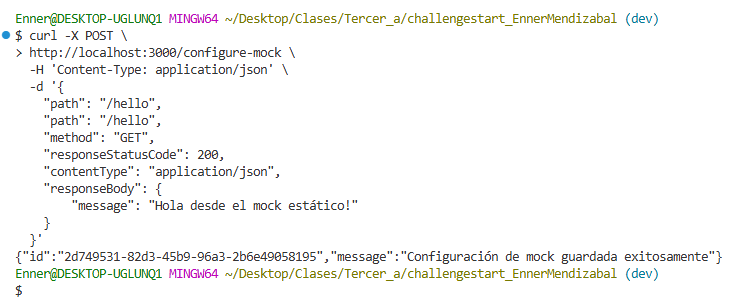

    Adicionalmente, se creará o actualizará un archivo `mocks.json` dentro de la carpeta `config` conteniendo esta y otras configuraciones:
    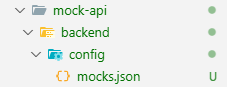

2.  **Configurar un mock con parámetros de consulta (`GET /greet?name=Juan`):**
    Este mock responderá a `GET /greet` solo si el `query param` `name` es `Juan`.
    ```bash
    curl -X POST \
      http://localhost:3000/configure-mock \
      -H 'Content-Type: application/json' \
      -d '{
        "path": "/greet",
        "method": "GET",
        "queryParams": {
            "name": "Juan"
        },
        "responseStatusCode": 200,
        "contentType": "application/json",
        "responseBody": {
            "message": "Hola, Juan! Eres especial."
        }
      }'
    ```
    Verás un mensaje de confirmación similar a:
    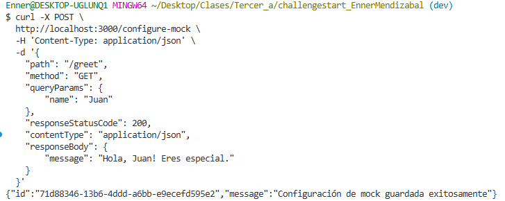

3.  **Configurar un mock con parámetros de cuerpo JSON (`POST /users`):**
    Este mock responderá a `POST /users` si el cuerpo JSON contiene `{"username": "testuser"}`.
    ```bash
    curl -X POST \
      http://localhost:3000/configure-mock \
      -H 'Content-Type: application/json' \
      -d '{
        "path": "/users",
        "method": "POST",
        "bodyParams": {
            "username": "testuser"
        },
        "responseStatusCode": 201,
        "contentType": "application/json",
        "responseBody": {
            "status": "User created",
            "id": "user-123",
            "username": "testuser"
        }
      }'
    ```
    Confirmación de la configuración:
    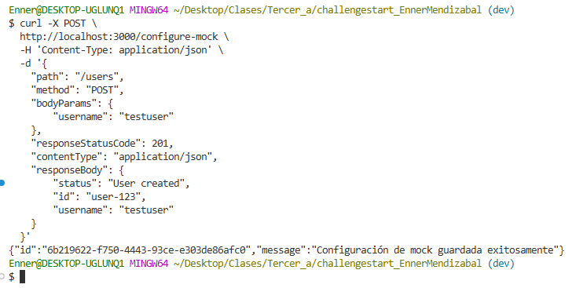

4.  **Configurar un mock con encabezados específicos (`GET /auth-check`):**
    Este mock responderá a `GET /auth-check` si el encabezado `Authorization` es `Bearer token123`.
    ```bash
    curl -X POST \
      http://localhost:3000/configure-mock \
      -H 'Content-Type: application/json' \
      -d '{
        "path": "/auth-check",
        "method": "GET",
        "headers": {
            "Authorization": "Bearer token123"
        },
        "responseStatusCode": 200,
        "contentType": "text/plain",
        "responseBody": "Acceso Autorizado."
      }'
    ```
    Confirmación de la configuración:
    

5.  **Configurar un mock con plantilla de respuesta (`POST /template-echo`):**
    Este mock utiliza una plantilla Go para generar una respuesta JSON dinámica que incluye datos de la solicitud.
    ```bash
    curl -X POST \
      http://localhost:3000/configure-mock \
      -H 'Content-Type: application/json' \
      -d '{
        "path": "/template-echo",
        "method": "POST",
        "responseStatusCode": 200,
        "contentType": "application/json",
        "isTemplate": true,
        "priority": 10,
        "responseBody": "{ \"received_path\": \"{{.Request.Path}}\", \"received_method\": \"{{.Request.Method}}\", \"query_params\": {{.Request.Query | json}}, \"body_data\": {{.Request.Body | json}}, \"custom_header\": \"{{getMapValue .Request.Headers \"x-custom-data\"}}\" }"
      }'
    ```
    Confirmación de la configuración:
    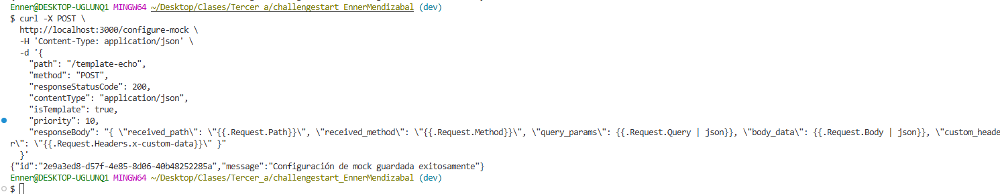

6.  **Obtener todas las configuraciones de mocks:**
    ```bash
    curl http://localhost:3000/configure-mock
    ```
    Se obtiene un arreglo JSON con todos los mocks configurados:
    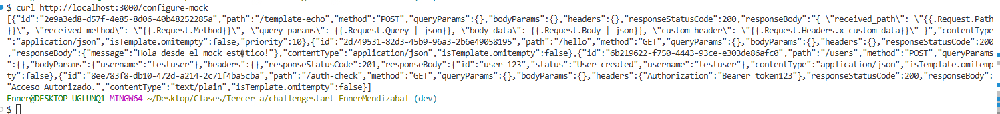

7.  **Eliminar una configuración de mock:**
    Reemplaza `TU_ID_DEL_MOCK_AQUI` con el ID real de un mock (ej. `2e9a3ed8-d57f-4e85-8d06-40b48252285a`).
    ```bash
    curl -X DELETE http://localhost:3000/configure-mock/2e9a3ed8-d57f-4e85-8d06-40b48252285a
    ```
    Verás un mensaje de confirmación:
    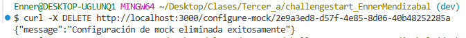

    Al obtener la lista de mocks nuevamente, el elemento eliminado ya no estará:
    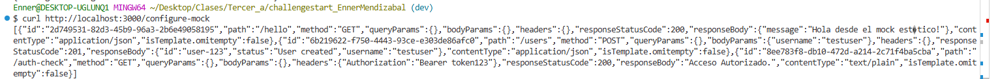

8.  **Probar un mock inexistente (después de eliminarlo):**
    Si intentas acceder a un mock que fue eliminado, el sistema devolverá un `404 Not Found`.
    ```bash
    curl http://localhost:3000/hello
    ```
    Respuesta de error:
    

9.  **Probar el mock con parámetros de consulta (`GET /greet?name=Juan`):**
    ```bash
    curl "http://localhost:3000/greet?name=Juan"
    ```
    Respuesta esperada:
    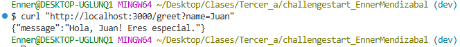

    Si los parámetros de consulta no coinciden:
    ```bash
    curl "http://localhost:3000/greet?name=Pedro"
    ```
    Respuesta de error:
    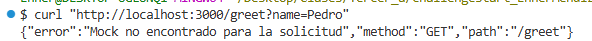

10. **Probar el mock con Body Params (`POST /users`):**
    ```bash
    curl -X POST \
      http://localhost:3000/users \
      -H 'Content-Type: application/json' \
      -d '{"username": "testuser", "email": "test@example.com"}'
    ```
    Respuesta esperada:
    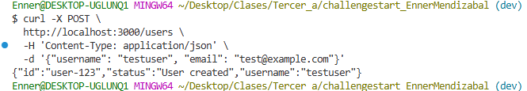

    Si el cuerpo no coincide con `bodyParams`:
    ```bash
    curl -X POST \
      http://localhost:3000/users \
      -H 'Content-Type: application/json' \
      -d '{"username": "otheruser"}'
    ```
    Respuesta de error:
    

11. **Probar el mock con Headers (`GET /auth-check`):**
    ```bash
    curl -X GET \
      http://localhost:3000/auth-check \
      -H 'Authorization: Bearer token123'
    ```
    Respuesta esperada:
    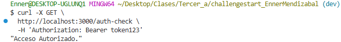

    Si el header falta o es incorrecto:
    ```bash
    curl -X GET \
      http://localhost:3000/auth-check
    ```
    Respuesta de error:
    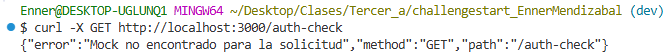

12. **Probar el mock con plantilla (`POST /template-echo`):**
    ```bash
    curl -X POST "http://localhost:3000/template-echo?param1=value1&param2=value2" \
      -H 'X-Custom-Data: MiDato' \
      -H 'Content-Type: application/json' \
      -d '{}'
    ```
    Respuesta dinámica esperada:
    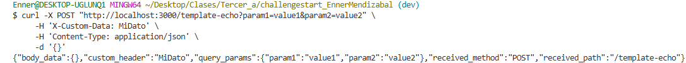

13. **Modificar mock (`POST /greet`):**
    ```bash
    curl -X POST -H "Content-Type: application/json" \
      -d '{
        "id": "6a84b9d5-74ef-45dd-a158-778363f873d7",
        "path": "/greet",
        "method": "GET",
        "queryParams": {
          "name": "Juan"
        },
        "bodyParams": {},
        "headers": {},
        "responseStatusCode": 200,
        "responseBody": "{\"message\": \"Hola, {{.queryParams.name}}! Bienvenido de nuevo.\"}",
        "contentType": "application/json",
        "isTemplate": true
      }' http://localhost:3000/configure-mock
    ```
    Respuesta esperada:
    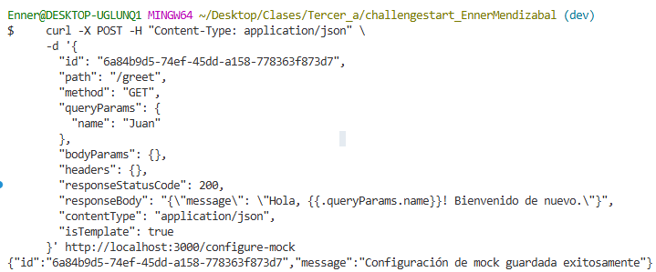

    Y debido a que se modifico, ahora responderá con lo siguiente:
    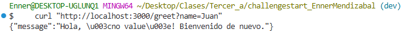

Esta sección ha mostrado las funcionalidades principales del programa. La API es capaz de manejar un rango mucho más amplio de escenarios de mocking.

### Uso con Frontend (Interfaz de Usuario Web)

Para una configuración más intuitiva, el proyecto incluye una interfaz de usuario web simple. Asegúrate de que el **backend y el frontend estén corriendo** como se describe en la sección de Instalación.

Partiendo de la interfaz inicial:
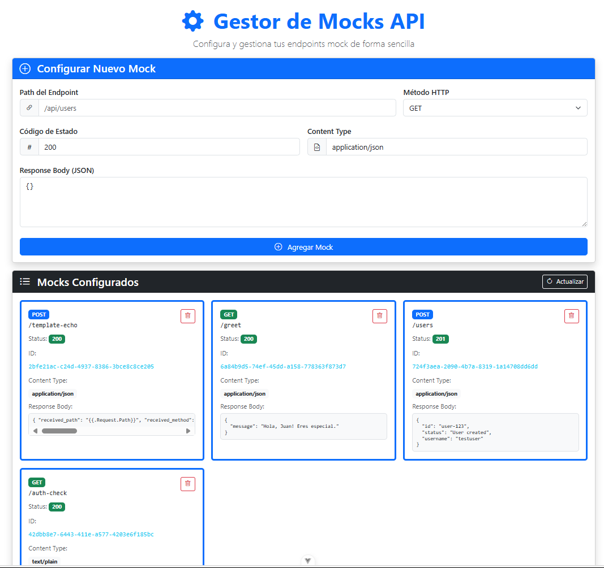

1.  **Agregar un nuevo mock (`GET /hello`):**
    En la sección "Configurar Nuevo Mock", completa los campos:
    -   **Path del Endpoint:** `/hello`
    -   **Método HTTP:** `GET`
    -   **Código de Estado:** `200`
    -   **Content Type:** `application/json`
    -   **Response Body (JSON):**
        ```json
        {
          "message": "Hola desde el mock estático!"
        }
        ```
    Luego, haz clic en el botón "Agregar Mock":
    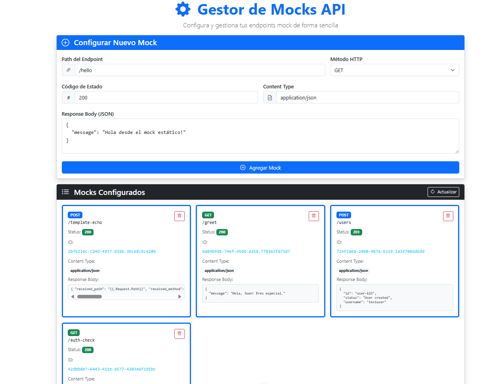

2.  **Visualizar el mock agregado:**
    Después de agregar, el nuevo mock aparecerá en la sección "Mocks Configurados":
    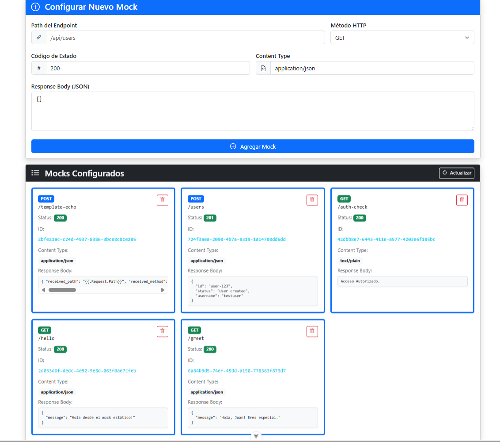

3.  **Eliminar un mock:**
    Haz clic en el ícono de la papelera (🗑️) en la esquina superior izquierda de la tarjeta del mock que deseas eliminar:
    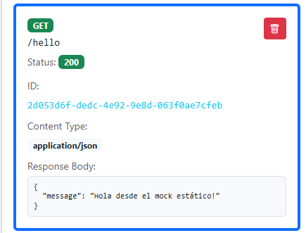

4.  **Confirmar eliminación:**
    Aparecerá un mensaje de confirmación para la acción:
    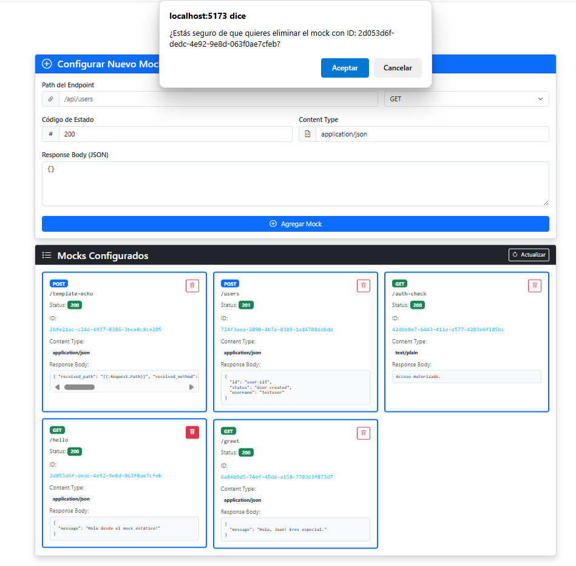

5.  **Mock eliminado:**
    Al confirmar, el mock será eliminado de la lista:
    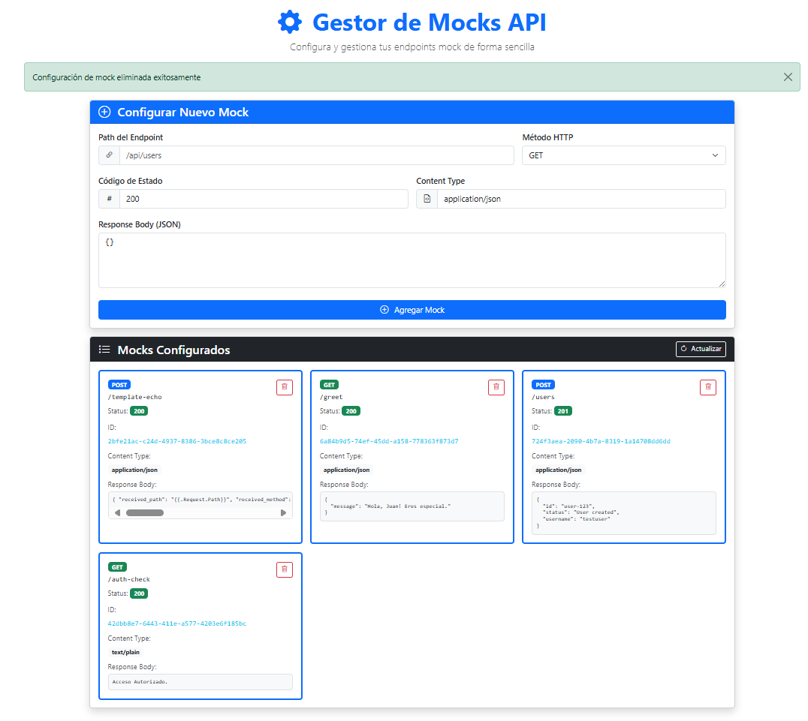


Esta interfaz simplifica la gestión de mocks sin necesidad de interactuar directamente con la línea de comandos.

## 🤖 Uso de Herramientas de IA

Esta sección detalla los prompts utilizados con diferentes Large Language Models (LLMs) para acelerar y asistir en el desarrollo de este proyecto. A cada modelo se le proporcionó contexto y los promps están en orden cronólogico en que fueron utilizados.

### Gemini 2.5 Flash

1.  `¿Qué son los mocks?`
2.  `Mi proyecto es crear un mock pero no sé qué es como se podría hacer, ¿podrías darme una idea de cómo hacerlo o un ejemplo?`
3.  `¿Lo haré con go y fiber, cómo debería de empezar?`
4.  `¿Cómo podría agregarle una variable de entorno para no quemar el puerto?`
5.  `Ya que te pasé todo, ¿cómo podría probarlo y saber si funciona correctamente?`
6.  `Entonces lo crearé el frontend en Vue con Vite, ¿cómo lo hago?`
7.  `Así dejé lo de Vue: #código .vue. Adicionalmente me pregunto por qué tuve que hacer los cambio en el backend de Go, dado a que entendería que funciona con cualquier host que le envíe una solicitud ¿no? Puesto a que me funcionó correctamente usando Postman.`
8.  `Así está lo que tengo del readme, ¿sigue correctamente la estructura que solicita el enunciado que debe de tener?`
9.  `Agrega las corrección que me mencionaste y retorname el código .md ya corregido, modificando unicamente lo que me indicaste, menos la parte en donde dictamina que se guarda en memoria, porque lo modifiqué para que se preserve la data.`
10. `En esta sección de código está lo de la Ejecución del MOCK, mi duda es como puedo irlo mejorando para agregarlo lo que solicita el enunciado.`
11. `¿Ahora me podrias mostrar como podria probar este api-mock?`
12. `Cuando coloco: curl http://localhost:3000/hello me está lanzando el siguiente error: $ curl http://localhost:3000/hello {"error":"Mock no encontrado para la solicitud","method":"GET","path":"/hello"} Es después de ya haber creado el mock, puesto a que todo se encuentra bien en mi json. ¿Cual puede ser el error?`
13. `Con los cambios funciona todo correctamente menos la parte de la template-echo. Esa al realizarle la prueba que me mencionas: $ curl "http://localhost:3000/template-echo?param1=value1&param2=value2" -H 'X-Custom-Data: MiDato' Me lanza el siguiente error: {"error":"Mock no encontrado para la solicitud","method":"GET","path":"/template-echo"} Si funciona todo, y en el json se encuentra Cual puede ser el error? Entiendo que debe de estar en mi función de ExecuteMock, ¿no?`
14. `Lo que tengo ahora en el readme está bien? Si no esta totalmente bien o cumpliendo con lo que indica elnunciado dímelo y arreglalo. Mejoralo y logra que se explique de mejor formas. Entregamelo en código .md`
15. `Agregale un índice`
16. `Con todas las pruebas que realizamos previamente demostramos que funcionaba todo lo que solicita el enunciado, ¿no? Ahora mi duda es como puedo mejorar la robustez del configure-mock`
17. `Asi lo dejé con los cambio que me mencionaste. Adicionalmente me pregunto, ¿qué tipos de rutas es capaz de leer la regex? En una págna normal no se usan las consideraciones no validas de este regex, ¿no?`

### Claude Sonnet 4

1.  `Haz que el siguiente código de VueJS sea más estético y que, de ser posible, que use lo máximo que se pueda Bootstrap con el CDN.`
2.  `Haz que se use lo menos posible el CSS para usar Bootstrap en su lugar, además reduce el ancho de la card que contiene todo.`
3.  `De esta estructura de archivo con VueJS con Vite, ¿qué debería de eliminar sin que afecte el funcionamiento del programa o que puedo agregar al .gitignore?`