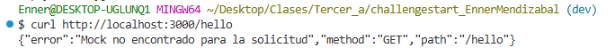
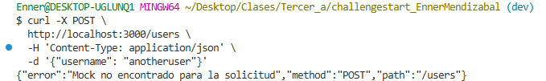

# API de Mocks para Servicios REST

## Objetivos

### Objetivo General

- Implementar y diseñar una API REST robusta en Go con Fiber que permita al usuario gestionar y simular dinámicamente respuestas personalizadas para endpoints de servicios externos, facilitando las pruebas en el desarrollo.

### Objetivos Específicos

- **Definir Estructura de Mocks:** Establecer una estructura clara y flexible para almacenar las configuraciones de los mocks, incluyendo ruta, método HTTP, parámetros de URL, `headers`, cuerpo de la solicitud, código de estado, tipo de contenido y contenido de la respuesta.

- **Implementar un Módulo de Configuración de Mocks:** Desarrollar los endpoints para la gestión completa de las configuraciones de mocks.

- **Desarrollar un Enrutamiento Dinámico de Mocks:** Crear un mecanismo que intercepte solicitudes entrantes, compare características con las configuraciones de los mocks almacenados y devuelva la respuesta predefinida correspondiente.

- **Asegurar la Calidad del Código y Documentación:** Aplicar buenas prácticas de desarrollo y proporcionar una documentación clara para la instalación y uso de la API.

## Arquitectura y Diseño del Sistema

El proyecto sigue una arquitectura de microservicio desacoplado con dos componentes principales: un backend API y una interfaz de usuario frontend.

### 1. Componentes Principales

-   **Backend (API de Mocks):** Desarrollado en Go utilizando el framework Fiber. Es el responsable de:
    -   Almacenar y gestionar las configuraciones de los mocks.
    -   Interceptar todas las solicitudes entrantes en rutas genéricas (excepto las de gestión).
    -   Evaluar las solicitudes contra las configuraciones de mocks para encontrar la coincidencia más apropiada.
    -   Devolver las respuestas simuladas según la configuración encontrada.

-   **Frontend (Interfaz de Usuario):** Desarrollado en Vue.js 3 con Vite. Proporciona una interfaz gráfica intuitiva para que los usuarios puedan:
    -   Crear nuevas configuraciones de mocks mediante un formulario interactivo.
    -   Visualizar una lista de todas las configuraciones de mocks activas.
    -   Eliminar configuraciones existentes.
    -   Recibir retroalimentación visual sobre el estado de las operaciones.

### 2. Funcionalidades Clave Implementadas

#### 2.1. Gestión de Configuración de Mocks

-   **Creación de Mocks** `POST /configure-mock`
    -   Permite registrar una nueva configuración de mock.
    -   Soporta la definición de `path`, `method`, `queryParams`, `headers` y `requestBody`.
    -   Permite la especificación del `statusCode`, `contentType` y `body` de la respuesta simulada.

-   **Listado de Mocks** `GET /configure-mock`
    -   Devuelve una lista de todas las configuraciones de mocks activas.

-   **Eliminación de Mocks** `DELETE /configure-mock/:id`
    -   Permite eliminar una configuración de mock específica utilizando su ID único.

#### 2.2. Ejecución de Mocks (Enrutamiento Dinámico)

-   **Enrutamiento Genérico**
    -   La API está configurada para interceptar cualquier solicitud HTTP entrante que no corresponda a sus rutas de administración.

-   **Coincidencia de Mocks**
    -   A partir de cada solicitud entrante, el sistema buscará la configuración de mock más apropiada basándose en:
        -   **La ruta exacta:** La ruta de la solicitud debe coincidir con la `path` configurada.
        -   **Método HTTP:** El método de la solicitud debe coincidir con el `method` configurado.
        -   **Parámetros de URL:** Si el mock tiene `queryParams` definidos, la solicitud debe contener esos parámetros con sus valores exactos.
        -   **Encabezados:** Si el mock tiene `headers` definidos, la solicitud debe incluir esos encabezados con sus valores exactos.
        -   **Cuerpo de la solicitud:** Si el mock tiene `bodyParams` definidos, el cuerpo JSON de la solicitud debe contener esos pares clave-valor exactos en el nivel superior.

-   **Devolución de Respuesta**
    -   Si se encuentra un mock que coincida, la API responderá con el `statusCode`, `contentType` y `body` definidos en la configuración del mock.
    -   Si no se encuentra ninguna coincidencia, la API devolverá un `404 Not Found`.

### 3. Decisiones de Diseño

#### 3.1. Selección de Tecnologías

-   **Go (Backend):** Elegido por su alto rendimiento, su modelo de concurrencia eficiente y su capacidad de compilación que facilitan el despliegue.

-   **Fiber (Framework Go):** Proporciona una API similar a Express.js, lo que agiliza el desarrollo rápido y eficiente de rutas HTTP y middlewares.

-   **Vue.js 3 (Frontend):** Seleccionado por su facilidad intuitiva de desarrollo, su  eficiencia y su capacidad para construir interfaces de usuario de forma declarativa.

-   **Vite:** Proporciona tiempos de carga rápidos en desarrollo (HMR) y es la herramienta de construcción recomendada actualmente para proyectos Vue.js, mejorando la experiencia del desarrollador.

-   **Bootstrap 5 & Icons:** Utilizado para un diseño responsive y atractivo con componentes predefinidos y una iconografía clara, acelerando el desarrollo de la UI.

#### 3.2. Almacenamiento de Mocks

La configuración de los mocks se almacena dentro de la carpeta `config` en formato JSON. Esta decisión se tomó para la simplicidad, velocidad de acceso y, crucialmente, para preservar la configuración al apagar o reiniciar el servidor, ofreciendo persistencia de datos.

#### 3.3. Generación de IDs

Se utiliza la librería `github.com/google/uuid` para asegurar la IDs únicos para cada mock, especialmente cuando no se proporciona un ID explícitamente en la configuración.

#### 3.4. Manejo de Errores

Se implementa un manejo de errores robusto tanto en el backend (respuestas JSON con códigos de estado HTTP apropiados y mensajes descriptivos) como en el frontend (alertas visuales al usuario), para proporcionar una experiencia de uso clara y consistente.

## Requisitos del Sistema

### Hardware

-   **Memoria RAM:** 512 MB (Recomendado 1 GB+ para desarrollo).

-   **Espacio en Disco:** 200 MB libre (para el código fuente, entorno Go, y dependencias).

-   **Procesador:** Cualquier CPU medianamente moderna.

### Software

-   **Sistema Operativo:** Compatible con Go (Linux, macOS, Windows).

-   **Go:** Versión 1.21 o superior.

-   **Git:** Para clonar el repositorio.

-   **Herramientas de Cliente HTTP:** cURL, Postman, Insomnia o similar para interactuar con la API.

-   **IDE/Editor:** Visual Studio Code (recomendado) con extensiones para Go, u otro editor/IDE de preferencia.

-   **Terminal/Consola:** Para compilar y ejecutar el backend.

-   **Node.js:** Versión 16 o superior (para el frontend con Vue/Vite).

-   **npm o Yarn:** Para gestionar las dependencias del frontend.

## Instalación y Ejecución

### Backend

1.  **Clonar el Repositorio:**
    ```bash
    git clone [https://github.com/Ennero/challengestart_EnnerMendizabal.git](https://github.com/Ennero/challengestart_EnnerMendizabal.git)

    cd challengestart_EnnerMendizabal/backend 
    ```

2.  **Descargar dependencias:**
    ```bash
    go mod tidy
    ```

3.  **Ejecutar la aplicación:**
    ```bash
    go run main.go
    ```
    La API se ejecutará en `http://localhost:3000` de forma predeterminada.
    Para iniciar con un puerto diferente:
    ```bash
    # Para Linux o macOS
    PORT=8080 go run main.go

    # Para CMD de Windows
    set PORT=8080 && go run main.go

    # Para PowerShell de Windows
    $env:PORT="8080"; go run main.go
    ```

### Frontend

Adicionalmente, para facilitar el uso del programa, se incluye una interfaz de usuario web que permite la configuración simple de nuevos mocks:

1.  **Dirigirse a la ubicación del archivo**
    ```bash
    cd challengestart_EnnerMendizabal/frontend
    ```

2.  **Descargar las dependencias**
    ```bash
    npm install

    # Opcional: para formatear el código
    npm run format 
    ```

3.  **Ejecutar la aplicación**
    ```bash
    npm run dev
    ```

4.  **Acceder a la aplicación:** Abre tu navegador y navega a la URL que te indicará Vite (usualmente `http://localhost:5173`).
   
    

## Ejemplo de Uso

### Uso sin Frontend

A continuación se presenta un ejemplo de como es que se puede usar el programa si es que no se desea utilizar el frontend:

1. Teniendo levantado así como se mostró previamente, en un consola colocaremos lo siguiente:
```bash
curl -X POST \
  http://localhost:3000/configure-mock \
  -H 'Content-Type: application/json' \
  -d '{
    "path": "/hello",
    "method": "GET",
    "responseStatusCode": 200,
    "contentType": "application/json",
    "responseBody": {
        "message": "Hola desde el mock estático!"
    }
  }'
```
Este mock se encargará de simplemente responder a ```GET /hello``` con el mensaje que se muestra en el JSON

2. Ese comando habrá configurado el primer mock y se mostrara un mensaje de confirmación como el siguiente:


3. Adicionalmente se puede observar dentro de la carpeta config, como es que se creó un archivo llamado ```mocks.json``` que contiene la configuración del mock en json


4. A continuación se crea un mock que reponderá a ```GET /greet?name=Juan``` con un mensaje personalizado:
```bash
curl -X POST \
  http://localhost:3000/configure-mock \
  -H 'Content-Type: application/json' \
  -d '{
    "path": "/greet",
    "method": "GET",
    "queryParams": {
        "name": "Juan"
    },
    "responseStatusCode": 200,
    "contentType": "application/json",
    "responseBody": {
        "message": "Hola, Juan! Eres especial."
    }
  }'
```

5. Y esto al ejecutarse, se motará un mensaje que confirmará la creación de esto:
   

6. Ahora se creará un mock que responderá a ``POST /users`` si el body JSON contiene ``{"username": "testuser"}``:
```bash
curl -X POST \
  http://localhost:3000/configure-mock \
  -H 'Content-Type: application/json' \
  -d '{
    "path": "/users",
    "method": "POST",
    "bodyParams": {
        "username": "testuser"
    },
    "responseStatusCode": 201,
    "contentType": "application/json",
    "responseBody": {
        "status": "User created",
        "id": "user-123",
        "username": "testuser"
    }
  }'
```

7. Este comando habrá configurado el segundo mock mostrará el siguiente mensaje de confirmación:


8. Ahora configuremos un mock que responda a GET /auth-check si el header ```Authorization``` es  ```Bearer token123```:
```bash
curl -X POST \
  http://localhost:3000/configure-mock \
  -H 'Content-Type: application/json' \
  -d '{
    "path": "/auth-check",
    "method": "GET",
    "headers": {
        "Authorization": "Bearer token123"
    },
    "responseStatusCode": 200,
    "contentType": "text/plain",
    "responseBody": "Acceso Autorizado."
  }'
```

9. Este comando habrá configurado el  tercer mock y mostrará el siguiente mensaje:


10. Ahora configuremos un último mock con plantilla:
```bash
curl -X POST \
  http://localhost:3000/configure-mock \
  -H 'Content-Type: application/json' \
  -d '{
    "path": "/template-echo",
    "method": "POST",
    "responseStatusCode": 200,
    "contentType": "application/json",
    "isTemplate": true,
    "priority": 10,
    "responseBody": "{ \"received_path\": \"{{.Request.Path}}\", \"received_method\": \"{{.Request.Method}}\", \"query_params\": {{.Request.Query | json}}, \"body_data\": {{.Request.Body | json}}, \"custom_header\": \"{{.Request.Headers.x-custom-data}}\" }"
  }'
```

11. Al configurarse se tendria el siguiente mensaje de confirmación:


12. Ahora para obtener todas las peticiones se coloca:
```bash
curl http://localhost:3000/configure-mock
```
Se obtiene un arreglo con todos los json configurados:


13. Ahora si se quiere quiere eliminar una configuración se colocaria:
```bash
curl -X DELETE http://localhost:3000/configure-mock/TU_ID_DEL_MOCK_AQUI
```

14. En este caso se eliminará el primer mock que aparece en el arreglo de json, el que tiene id ```2e9a3ed8-d57f-4e85-8d06-40b48252285a``` y aparecerá el siguiente mensaje de confirmación:


15. Y si revisamos el contenido del array, podemos notar que ya no se encuentra el primer elemento que aparecía anteriormente:


16. Ahora si se intenta probar el primer mock que se utilizó, no funcionará correctamente debido a que se eliminó.



17. Pero si se quiere probar el mock con parámetro de query colocando lo siguiente:
```bash
curl "http://localhost:3000/greet?name=Juan"
```
Se obtiene lo siguiente:


18. Y si no coincide la petición con el query, dará el siguiente error:


19. Ahora para probar el Mock con Body Params, si ingreso lo siguiente:
```bash
curl -X POST \
  http://localhost:3000/users \
  -H 'Content-Type: application/json' \
  -d '{"username": "testuser", "email": "test@example.com"}'
```
retornará el continido que se muestra a continuación:


20. Si el body no coincide, de el siguiente error que se puede observar:


21. Ahora puede probar el mock que usa headers colocando la siguiente petición:
```bash
curl -X GET \
  http://localhost:3000/auth-check \
  -H 'Authorization: Bearer token123'
```

22. Al usar este mock se puede observar que retorna el siguiente mensaje de confirmación 


23. Ahora observando el caso en el que el header falta o es incorrecta, muestra el siguiente mensaje de error:


24. Por último se puede probar el mock con plantilla usando el siguiente código:
```bash
curl -X POST "http://localhost:3000/template-echo?param1=value1&param2=value2" \
     -H 'X-Custom-Data: MiDato' \
     -H 'Content-Type: application/json' \
     -d '{}'
```

25. Y este terminará retornando lo siguiente:


Aquí se intentó mostrar las funcionalidades más importantes del programa, peor es capaz de hacer muchas más cosas.

### Uso con Frontend

Como se mencinó previamente, para facilitar el uso de decidió crear una interfaz de usuario simple que permita una configuración más simple de los mocks. De este modo no se tendria que usar curl para eso.
Partiendo de lo que se tiene de la demostración previa:


1. Desde esta interfaz se puede manejar todo de una forma más simplificada, en la explicación anterior se eliminó el primer mock, por lo que se agregará a continuación el siguiente mock que se agregó desde curl:
```bash
curl -X POST \
  http://localhost:3000/configure-mock \
  -H 'Content-Type: application/json' \
  -d '{
    "path": "/hello",
    "method": "GET",
    "responseStatusCode": 200,
    "contentType": "application/json",
    "responseBody": {
        "message": "Hola desde el mock estático!"
    }
  }'
```
Pero ahora desde la interfaz de usuario:


2. Después de pulsar el botón de Agregar Mock, se puede observar que efectivamente se agregó el nuebo mock:


3. Ahora bien, si quiero eliminarlo simplemente se pulsa en el simbolo en la esquina superior izquierda de este para poder eliminarlo:


4. Al intentar eliminarse aparece un mensaje de confirmación de la acción:


5. Y por último, al hacer click en aceptar, se elimina el mock configurado.


## Uso de herramientas IA

Esta sección detallará los prompts utilizados para acelerar el desarrollo de este proyecto dividido por LLM:

### Gemini 2.5 flash

1.  ¿Qué son los mocks?

2.  Mi proyecto es crear un mock pero no sé qué es como se podría hacer, ¿podrías darme una idea de cómo hacerlo o un ejemplo?

3.  ¿Lo haré con go y fiber, cómo debería de empezar?

4.  ¿Cómo podría agregarle una variable de entorno para no quemar el puerto?

5.  Ya que te pasé todo, ¿cómo podría probarlo y saber si funciona correctamente?

6.  Entonces lo crearé el frontend en Vue con Vite, ¿cómo lo hago?

7.  Así dejé lo de Vue: ``#código .vue``. Adicionalmente me pregunto por qué tuve que hacer los cambio en el backend de Go, dado a que entendería que funciona con cualquier host que le envíe una solicitud ¿no? Puesto a que me funcionó correctamente usando Postman.

8. Así está lo que tengo del readme, ¿sigue correctamente la estructura que solicita el enunciado que debe de tener?

9. Agrega las corrección que me mencionaste y retorname el código .md ya corregido, modificando unicamente lo que me indicaste, menos la parte en donde dictamina que se guarda en memoria, porque lo modifiqué para que se preserven los datos

10. En esta sección de código está lo de la Ejecución del MOCK, mi duda es como puedo irlo mejorando para agregarlo lo que solicita el enunciado

11. ¿Ahora me podrias mostrar como podria probar este api-mock?

12. Cuando coloco: curl http://localhost:3000/hello me está lanzando el siguiente error: $ curl http://localhost:3000/hello
{"error":"Mock no encontrado para la solicitud","method":"GET","path":"/hello"} Es después de ya haber creado el mock, puesto a que todo se encuentra bien en mi json. ¿Cual puede ser el error?

13. Con los cambios funciona todo correctamente menos la parte de la template-echo. Esa al realizarle la prueba que me mencionas: $ curl "http://localhost:3000/template-echo?param1=value1&param2=value2" -H 'X-Custom-Data: MiDato' Me lanza el siguiente error: {"error":"Mock no encontrado para la solicitud","method":"GET","path":"/template-echo"} Si funciona todo, y en el json se encuentra Cual puede ser el error? Entiendo que debe de estar en mi función de ExecuteMock, ¿no?


### Claude Sonnet 4

1.  Haz que el siguiente código de VueJS sea más estético y que, de ser posible, que use lo máximo que se pueda Bootstrap con el CDN.

2.  Haz que se use lo menos posible el CSS para usar Bootstrap en su lugar, además reduce el ancho de la card que contiene todo.

3.  De esta estructura de archivo con VueJS con Vite, ¿qué debería de eliminar sin que afecte el funcionamiento del programa o que puedo agregar al `.gitignore`?